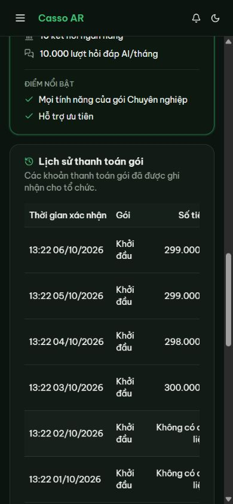
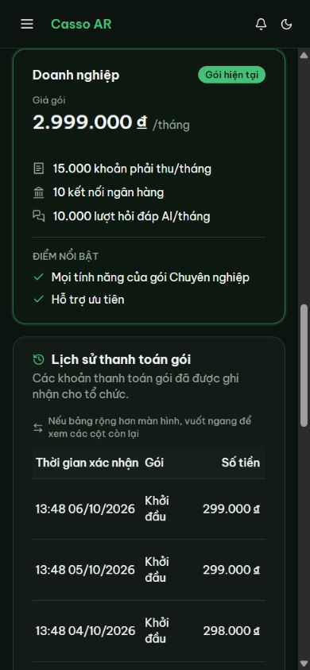
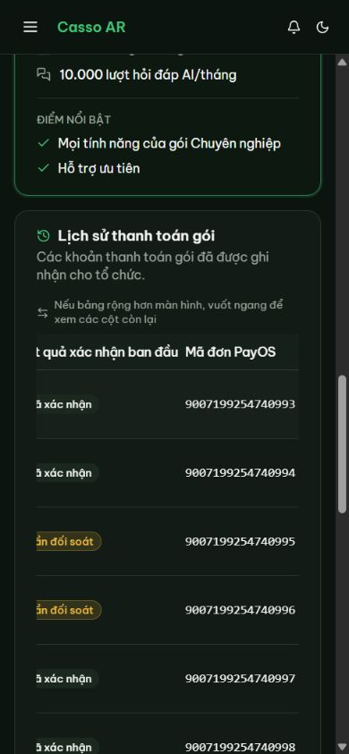
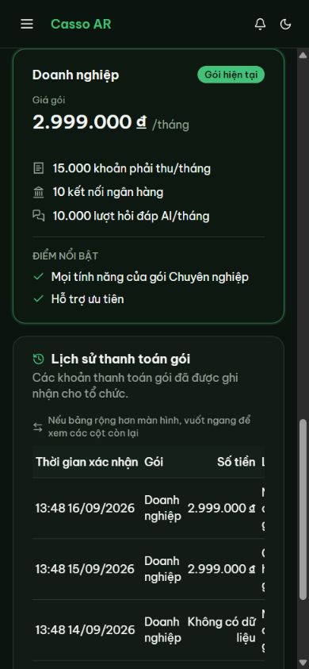
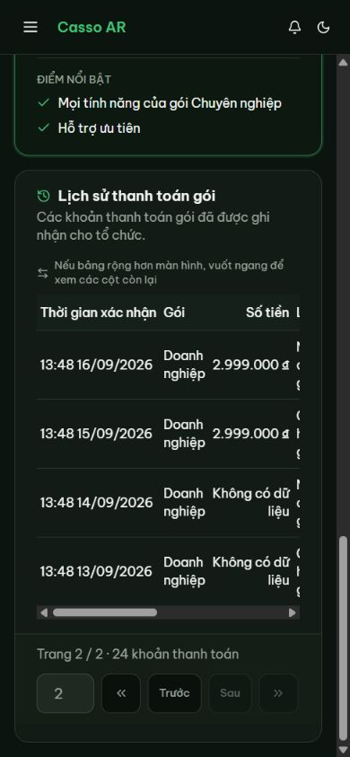
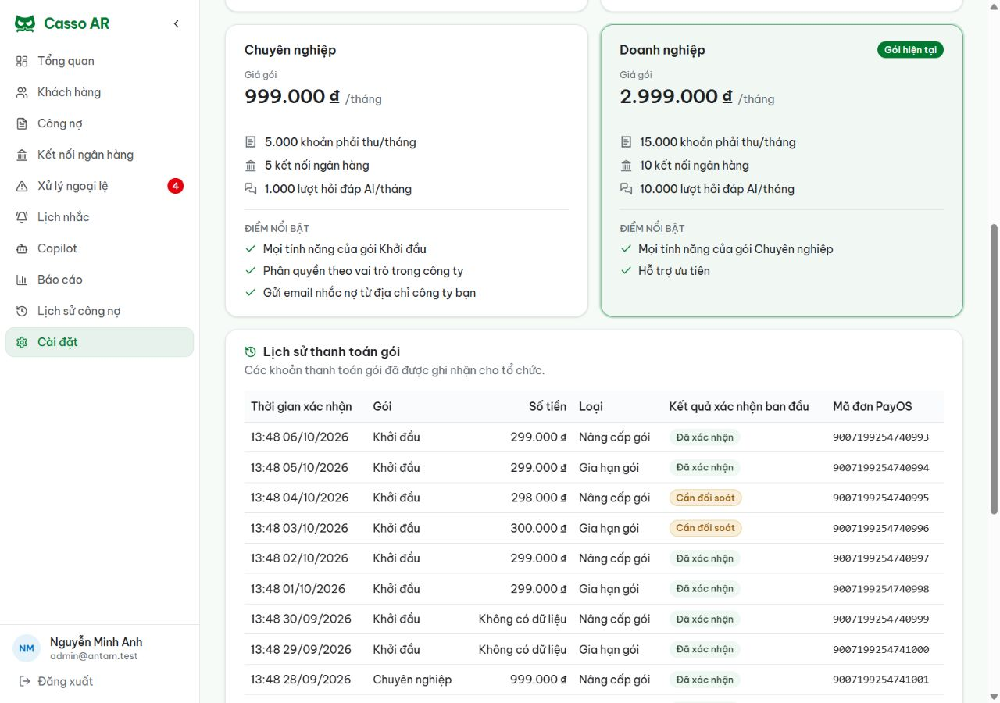

# UI/UX audit — issue #476

## Browser pass

Audited the local app in Codex In-app Browser as the seeded OWNER account. The
frontend and backend used the local Docker database. Checked light and dark
themes and viewports 360×800, 390×844, 767×900, 900×900, 1024×900, and
1280×900.

The fixture contains 24 rows (two pages), with both plan upgrades and renewals;
accepted and review-required webhook receipts; legacy receipts with known and
unknown amounts; all three paid plan tiers; and PayOS order codes above
`Number.MAX_SAFE_INTEGER`. Re-running `seed:payment-history` kept the row count
at 24.

## Findings and fixes

- At 360px and 390px, the 648px history table fits inside a horizontally
scrollable region, but the original page gave no cue that more columns were
available. Added a conditional swipe hint and reduced cell padding below the
wide desktop breakpoint. The page itself stays within the viewport. The table
fits at 767px and 1024px; it scrolls at 900px where the desktop sidebar leaves
less content width.
- The shared pagination controls were 32px high on mobile. They are now 44px
high below 1280px, including the page input and icon buttons.
- “Cần đối soát” used the destructive red badge. It now uses the existing
warning tokens, matching the non-final review state in both themes.

Desktop and rightmost-column checks confirmed VND amounts, unknown legacy
amounts, plan labels, confirmation outcomes, and long PayOS codes remain
readable. Page two has four rows and reports “Trang 2 / 2 · 24 khoản thanh
toán”. Loading, empty, error/retry, and out-of-range-page behavior are covered
by the existing component tests.

## Evidence

